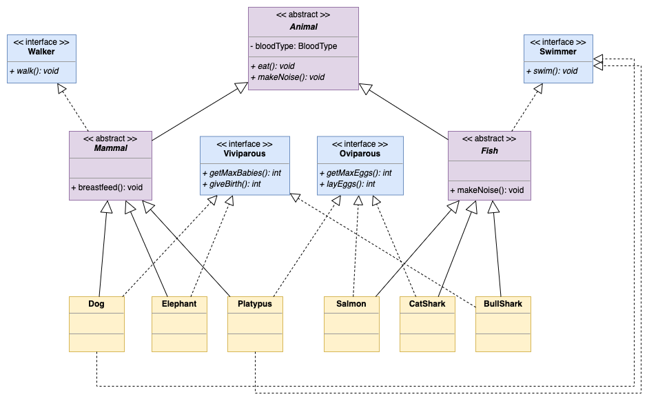

# [Class 06 - Improved Animal Kingdom](https://redi-school.github.io/intermediate-java/06-oop-3-abstract-classes-and-interfaces/)

## Description

In the [previous exercise](https://classroom.github.com/a/swd2uLN2), we implemented a representation of the Animal Kingdom with the use of Inheritance.

We saw that there were some problems with the previous implementation, as for example:
1. We defined generic classes (Animal, Mammal and Fish), which should not allow instantiation
2. We ended up having issues with extremely exceptional animals that could not be represented easily (eg. Fish that didn't lay eggs, or Mammals that lay eggs)

Let's give this exercise another go, trying to solve these issues by using Abstract Classes and Interfaces.

### Overview

Let's use the same list of properties and behaviours from the previous exercise, with the addition of the lovely [Platypus](https://en.wikipedia.org/wiki/Platypus):

|    |              |
|:--------------------------------:|:------------------------------------:|
|        |  |
|  |  |

An improved solution could be designed as shown in the UML diagram below:



Follow the instructions below to create the corresponding Java code. 

For this exercise, we recommend you to not copy-paste the code from the previous exercise directly into this one.
- Instead, create the structure from scratch and reuse just the logic from inside the methods

## Tasks
  
### Step 1 - Define the Animal class
Let's create the base class of our Animal Kingdom
1. Create a class called 'Animal'
   - The class needs to be abstract
2. Create an attribute called `bloodType`
   - the attribute must be of type `BloodType` (the enumeration is already provided for you)
   - the variable must be `private` and `final`
3. Define a constructor
   - it must receive the `bloodType` value as a parameter
4. Define a getter method for the `bloodType` property
   - don't define a setter! (the variable is `final`, thus read-only)
5. Define a method called `eat`
   - the method should return `void`
   - the method should be `abstract`
6. Define a method called `makeNoise`
   - the method should return `void`
   - the method should be `abstract`
    
### Step 2 - Define the Mammal class
Let's create classes to represent the group of Mammals 
1. Create a class called 'Mammal'
   1. It must extend from the Animal class and be `abstract`
   2. It has a default constructor
      - it passes `BloodType.WARM` to the constructor of the superclass
   3. It defines a new method called `breastfeed`
      - it returns `void`
      - it prints "_breastfeeding_" to the standard output
2. Now, create a class called 'Dog'
   1. It must extend from the Mammal class, and must be a concrete class (not `abstract`)
   2. It has a default constructor
   3. It implements the method `makeNoise` from the Animal class
      - the method should print "_woof woof_" in the console output
   4. It implements the method `eat` from the Animal class
      - the method should print "_This bone is delicious_" in the console output
3. Then, create a class called 'Elephant'
   1. It must also extend from the Mammal class and be a concrete class
   2. It has a default constructor
   3. It implements the method `makeNoise` from the Animal class
      - the method should print "_bahruuuuuuhhhhaaaaa_" in the console output
   4. It implements the method `eat` from the Animal class
      - the method should print "_This hay is delicious_" in the console output
4. Finally, create a class to represent the extraordinary 'Platypus'
   1. It must also extend from the Mammal class and be a concrete class
   2. It has a default constructor
   3. It implements the method `makeNoise` from the Animal class
      - the method should print "_gyururururururu_" in the console output
   4. It implements the method `eat` from the Animal class
      - the method should print "_This insect larvae is delicious_" in the console output
      
### Step 3 - Define the Fish class
Let's create classes to represent the group of Fish
1. Create a class called 'Fish'
   1. It must extend from the Animal class and be `abstract`
   2. It has a default constructor
      - it passes `BloodType.COLD` to the constructor of the superclass
   3. It implements the method `makeNoise` from the Animal class
      - the method should print "_glub glub_" in the console output
2. Now, create a class called 'Salmon'
   1. It must extend from the Fish class
   2. It has a default constructor
   3. It overrides the method `eat` from the Animal class
      - the method should print "_This small pray is delicious_" in the console output
3. Then, create a class called 'CatShark'
   1. It must also extend from the Fish class
   2. It has a default constructor
   3. It overrides the method `eat` from the Animal class
      - the method should print "_This small fish is delicious_" in the console output
4. Finally, create a class called 'BullShark'
   1. It must also extend from the Fish class
   2. It has a default constructor
   3. It overrides the method `eat` from the Animal class
      - the method should print "_This human is delicious_" in the console output

### Step 4 - Define the Walker interface
Let's assume that all Mammals can walk.
1. Create an interface called 'Walker'
   1. The interface should define a no-params abstract method called `walk`, which returns void
2. Declare that a 'Mammal' implements the 'Walker' interface
   1. But don't implement the `walk` method inside the Mammal class!
3. Now, implement the `walk` method in the concrete classes 'Dog', 'Elephant' and 'Platypus'
   1. Each implementation should print a different message in the standard output

### Step 5 - Define the Swimmer interface
Let's assume that all Fish can swim, but also some Mammals.
1. Create an interface called 'Swimmer'
   1. The interface should define a no-params abstract method called `swim`, which returns void
2. Declare that a 'Fish' implements the 'Swimmer' interface
   1. But don't implement the `swim` method inside the Fish class!
3. Now, implement the `swim` method in the concrete classes 'Salmon', 'CatShark' and 'BullShark'
   1. Each implementation should print a different message in the standard output
4. Additionally, make the Dog and Platypus classes to implement the Swimmer interface

### Step 6 - Define the Viviparous interface
The majority of Mammals and even some Fish are viviparous!
1. Create an interface called 'Viviparous'
   1. The interface should define a no-params abstract method called `getMaxBabies`, which returns an integer number
   2. Should also define a no-params abstract method called `giveBirth`, which returns an `int` that represents the number of spawned babies
2. Now make some animals Viviparous!
   1. Make the 'Dog' class to implement the 'Viviparous' interface
      1. Implement the method `getMaxBabies`
         - it should always return `24`
      2. Implement the method `giveBirth`
         - the number of spawned babies should be a random number between 1 and `getMaxBabies`
   2. Make the 'Elephant' class to implement the 'Viviparous' interface
      1. Implement the method `getMaxBabies`
         - it should always return `2`
      2. Implement the method `giveBirth`
         - the number of spawned babies should be a random number between 1 and `getMaxBabies`
   3. Make the 'BullShark' class to implement the 'Viviparous' interface
      1. Implement the method `getMaxBabies`
         - it should always return `13`
      2. Implement the method `giveBirth`
         - the number of spawned babies should be a random number between 1 and `getMaxBabies`

### Step 7 - Define the Oviparous interface
The majority of Fish and even some Mammals are oviparous!
1. Create an interface called 'Oviparous'
   1. The interface should define a no-params abstract method called `getMaxEggs`, which returns an integer number
   2. Should also define a no-params abstract method called `layEggs`, which returns an `int` that represents the number of produced eggs
2. Now make some animals Oviparous!
   1. Make the 'Salmon' class to implement the 'Oviparous' interface
      1. Implement the method `getMaxEggs`
         - it should always return `2800`
      2. Implement the method `layEggs`
         - in the first time that is called, it performs the logic from the superclass
         - after the first time, it must return 0 (salmon can lay eggs only once)
         - hint: you can use a private variable to control the amount of times the method is called ;)
   2. Make the 'CatShark' class to implement the 'Oviparous' interface
      1. Implement the method `getMaxEggs`
         - it should always return `20`
      2. Implement the method `layEggs`
         - the number of spawned babies should be a random number between 1 and `getMaxBabies`
   3. Make the 'Platypus' class to implement the 'Oviparous' interface
      1. Implement the method `getMaxEggs`
         - it should always return `2`
      2. Implement the method `layEggs`
         - the number of spawned babies should be a random number between 1 and `getMaxBabies`

### Step 8 - Use the classes altogether!

This step is pretty easy.
1. Copy the given code below to your `main` method
2. Then, run it and evaluate what it is doing (comments will help you understand)
3. Finally, consider the following questions:
   1. Can you instantiate objects from classes Animal, Mammal and Fish?
   2. The logic to lay eggs at random is common to all Oviparous, and it's duplicated everywhere. How would you improve that?
   
```java
   public static void main(String[] args) {

        // The Animal Kingdom list
        List<Animal> animalKingdom = new ArrayList<>();
        // Adding some animals
        animalKingdom.add(new Dog());
        animalKingdom.add(new Elephant());
        animalKingdom.add(new Platypus());
        animalKingdom.add(new Salmon());
        animalKingdom.add(new CatShark());
        animalKingdom.add(new BullShark());
        // printing information from all animals
        for (Animal animal : animalKingdom) {

            System.out.println("----------------------------------");
            // gets the name of the most specific class type
            String className = animal.getClass().getSimpleName();
            System.out.println(className.toUpperCase());
            // printing some information from Animal class
            System.out.println("Blood: " + animal.getBloodType());
            System.out.print("Sound: ");
            animal.makeNoise();
            System.out.print("Eat: ");
            animal.eat();
            // printing extra information from extended classes
            if (animal instanceof Mammal) {
                Mammal m = (Mammal) animal;
                System.out.print("Breastfeed: ");
                m.breastfeed();
            }
            // printing extra information from interfaces
            if (animal instanceof Walker) {
                Walker w = (Walker) animal;
                System.out.print("Walk: ");
                w.walk();
            }
            if (animal instanceof Swimmer) {
                Swimmer s = (Swimmer) animal;
                System.out.print("Swim: ");
                s.swim();
            }
            if (animal instanceof Oviparous) {
                Oviparous o = (Oviparous) animal;
                System.out.println("Max Eggs: " + o.getMaxEggs());
                System.out.println("Lay Eggs generated: "+o.layEggs()+" eggs");
            }
            if (animal instanceof Viviparous) {
                Viviparous v = (Viviparous) animal;
                System.out.println("Max Babies: " + v.getMaxBabies());
                System.out.println("Give Birth generated: "+v.giveBirth()+" children");
            }
        }
        System.out.println("----------------------------------");
   }
```

## Wants a Challenge? (Optional)
1. Analyse and implement the other animal groups (Birds, Amphibians and Reptiles)
2. Think about the exceptional case (there is always one, huh?) of the [Toxeus magnus](https://en.wikipedia.org/wiki/Toxeus_magnus), which is a **Spider who can breastfeed** (God, why??).
   - Considering a Spider is an Insect, how would you implement this class?
   - Also considering Insects don't have blood, but rather a fluid called "Hemolymph", what would you change in the existing code to support this new characteristic?